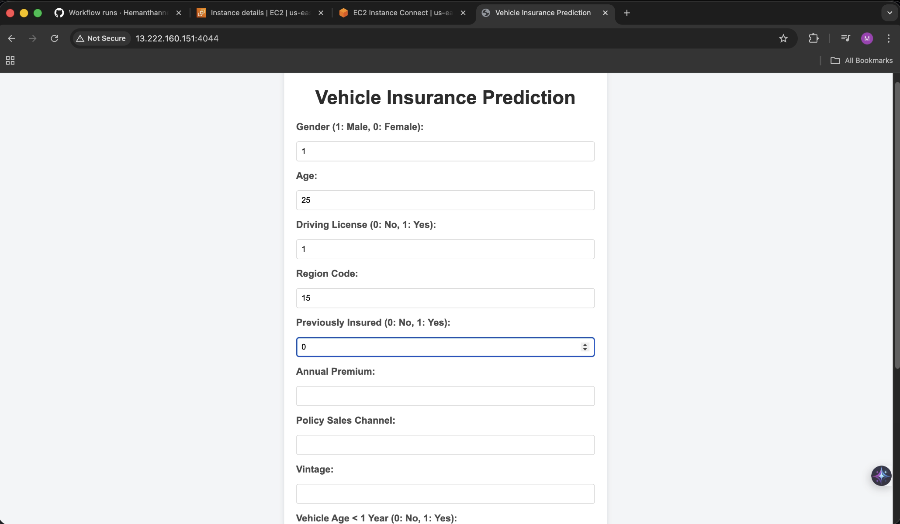

# MLOps Project: Vehicle Insurance Engagement Prediction 🚗

---

## 💡 Project Overview

This is a comprehensive end-to-end **MLOps (Machine Learning Operations)** project that tackles the challenge of **vehicle insurance engagement prediction**. The primary goal is to build a robust and scalable machine learning pipeline that predicts whether a user will be interested in purchasing vehicle insurance. This project demonstrates a deep understanding of modern software development practices, including CI/CD (Continuous Integration/Continuous Deployment), and leverages cloud-native technologies to build a production-ready system.

My solution is built on a Software Development Engineer (SDE) methodology, focusing on clean architecture, modularity, and automation. The entire workflow, from data ingestion to model deployment and monitoring, is automated, ensuring reliability and efficiency.

---

## 🚀 Key Features

* **End-to-End MLOps Pipeline**: A complete, automated pipeline that handles everything from data ingestion and validation to model training, evaluation, and deployment.
* **Scalable Architecture**: The project is built to handle large datasets and can be scaled up.
* **CI/CD Implementation**: A robust CI/CD pipeline is set up using GitHub Actions to automate testing and deployment to an **AWS EC2** instance, ensuring every code change is automatically validated and deployed.
* **Containerization**: The application is containerized using **Docker**.
* **Cloud Integration**: The project extensively uses **AWS** services for model storage (**S3**) and deployment (**EC2**).
* **Database Management**: **MongoDB Atlas** is used to handle and manage the project's data.
* **Logging and Exception Handling**: Robust logging and exception-handling mechanisms are implemented throughout the project for easy debugging and monitoring.


---

## 🏗️ System Architecture

### High-Level System Overview

```
┌─────────────────────────────────────────────────────────────────────┐
│                         DATA SOURCES                                │
├─────────────────────────────────────────────────────────────────────┤
│  MongoDB Atlas (Customer & Vehicle Data)                            │
└─────────────────────────────────────────────────────────────────────┘
                                ↓
┌─────────────────────────────────────────────────────────────────────┐
│                    TRAINING PIPELINE (Offline)                      │
├─────────────────────────────────────────────────────────────────────┤
│  1. Data Ingestion      → Fetch from MongoDB, train/test split      │
│  2. Data Validation     → Schema check, drift detection             │
│  3. Data Transformation → Preprocessing, scaling                    │
│  4. Model Training      → XGBoost classifier                        │
│  5. Model Evaluation    → Compare with production model             │
│  6. Model Pusher        → Deploy to S3 if better                    │
└─────────────────────────────────────────────────────────────────────┘
                                ↓
┌─────────────────────────────────────────────────────────────────────┐
│                    MODEL STORAGE                                    │
├─────────────────────────────────────────────────────────────────────┤
│  AWS S3 (Production Model + Preprocessor)                           │
└─────────────────────────────────────────────────────────────────────┘
                                ↓
┌─────────────────────────────────────────────────────────────────────┐
│                  PREDICTION PIPELINE (Online)                       │
├─────────────────────────────────────────────────────────────────────┤
│  FastAPI Application → Load model from S3 → Make predictions        │
└─────────────────────────────────────────────────────────────────────┘
                                ↓
┌─────────────────────────────────────────────────────────────────────┐
│                      CI/CD PIPELINE                                 │
├─────────────────────────────────────────────────────────────────────┤
│  Code Push → GitHub Actions → Build Docker → ECR → Deploy to EC2    │
└─────────────────────────────────────────────────────────────────────┘
```

---

### CI/CD Workflow (Automated Deployment)

```
Developer                    GitHub Actions              AWS Cloud
    │                              │                          │
    │ git push origin main         │                          │
    ├──────────────────────────────>│                         │
    │                              │                          │
    │                     ┌────────┴────────┐                 │
    │                     │   CI JOB        │                 │
    │                     │ (GitHub Runner) │                 │
    │                     ├─────────────────┤                 │
    │                     │ 1. Checkout     │                 │
    │                     │ 2. Build Image  │                 │
    │                     │ 3. Push to ECR  │────────────────> │
    │                     └────────┬────────┘         ┌───────┴──────┐
    │                              │                  │   AWS ECR    │
    │                     ┌────────┴────────┐         │ Docker Image │
    │                     │   CD JOB        │         └───────┬──────┘
    │                     │ (Self-Hosted)   │                 │
    │                     ├─────────────────┤                 │
    │                     │ 1. Pull Image   │<────────────────┤
    │                     │ 2. Stop Old     │                 │
    │                     │ 3. Run New      │                 │
    │                     └────────┬────────┘                 │
    │                              │                          │
    │                              v                          │
    │                     ┌─────────────────┐                 │
    │                     │   EC2 Instance  │                 │
    │                     │  App Running    │                 │
    │                     │  Port: 4044     │                 │
    │                     └─────────────────┘                 │
    │                              │                          │
    │ Users access app             │                          │
    │<─────────────────────────────┘                          │
```

---

### Training Pipeline - Component Flow

```
┌──────────────────────┐
│  Data Ingestion      │  Fetches data, creates train/test split
└──────────┬───────────┘  Quality Gate: Data exists, correct format
           │
           ↓ (DataIngestionArtifact)
┌──────────────────────┐
│  Data Validation     │  Validates schema, checks data drift
└──────────┬───────────┘  Quality Gate: Schema match, drift < threshold
           │
           ↓ (DataValidationArtifact)
┌──────────────────────┐
│ Data Transformation  │  Preprocessing, scaling, feature engineering
└──────────┬───────────┘  Artifact: Preprocessor object + transformed data
           │
           ↓ (DataTransformationArtifact)
┌──────────────────────┐
│   Model Training     │  Trains XGBoost, evaluates metrics
└──────────┬───────────┘  Quality Gate: F1 score > threshold (0.6)
           │
           ↓ (ModelTrainerArtifact)
┌──────────────────────┐
│  Model Evaluation    │  Compares with production model
└──────────┬───────────┘  Quality Gate: New model > Old model
           │
           ↓ (ModelEvaluationArtifact: is_model_accepted)
┌──────────────────────┐
│   Model Pusher       │  Deploys to S3 if accepted
└──────────────────────┘  Result: Model in production
```

---

### Key Design Patterns

**1. Config-Artifact Pattern**
- Each component receives **Config** (configuration/instructions)
- Each component produces **Artifact** (results + metadata)
- Enables modularity, testability, and clean separation of concerns

**2. Three Quality Checks**
- **Data Validation**: Schema validation and drift detection
- **Model Training**: Minimum F1 score threshold (0.6)
- **Model Evaluation**: New model must outperform production model


---

## 📋 Project Flow

**Complete Workflow:**
**Data Ingestion ➡️ Data Validation ➡️ Data Transformation ➡️ Model Training ➡️ Model Evaluation ➡️ Model Pusher ➡️ Prediction Pipeline**

### Phase 1: Project Setup and Environment Configuration
1.  **Project Templating**: An automated script (`template.py`) is used to set up the foundational project structure.
2.  **Package Management**: Local packages are configured using `setup.py` and `pyproject.toml` for easy dependency management.
3.  **Virtual Environment**: A dedicated Conda virtual environment is created to isolate project dependencies.

### Phase 2: Data Handling and Storage with MongoDB
1.  **MongoDB Atlas Setup**: A cloud-based MongoDB cluster is configured on Atlas.
2.  **Database Connection**: Connection strings are securely stored as environment variables.
3.  **Data Ingestion**: A notebook is used to load and push the raw dataset to the MongoDB database.

---

### Phase 3: Core ML Pipeline Components
1.  **Data Ingestion**: Data is securely fetched from MongoDB and converted into a DataFrame, then split into training and testing sets.
2.  **Data Validation**: The ingested data is validated against a predefined schema (`schema.yaml`) to ensure data integrity and quality. Drift detection is performed to identify distribution changes.
3.  **Data Transformation**: Raw data is transformed through feature engineering and preprocessing steps (encoding, scaling) to prepare it for model training. The preprocessor object is saved for consistent prediction-time transformations.
4.  **Model Training**: An XGBoost classifier is trained on the preprocessed data with hyperparameter tuning.
5.  **Model Evaluation**: The newly trained model is compared against the current production model using the same test dataset to ensure improvements.
6.  **Model Pusher**: Only if the new model outperforms the production model is it pushed to AWS S3 for deployment.

---

### Phase 4: Cloud Integration and Deployment
1.  **AWS Setup**: IAM users, S3 buckets (for model storage), ECR (for Docker images), and EC2 instances are configured to support the MLOps workflow. Access keys are securely set as environment variables.
2.  **Model Registry**: The trained model and preprocessor are stored in an S3 bucket, serving as a central model registry for versioning and retrieval.
---

### Phase 5: Production and CI/CD
1.  **Prediction Pipeline**: The final machine learning model is exposed via a FastAPI application that loads the model from S3 and serves predictions.
2.  **Containerization**: A Dockerfile is created to containerize the entire application, ensuring consistency across environments.
3.  **CI/CD Pipeline**: A GitHub Actions workflow (`aws.yaml`) automates the complete deployment process:
    * **Continuous Integration (CI Job)**: Runs on GitHub-hosted runners
        - Checks out code
        - Builds Docker image with latest code
        - Pushes image to AWS ECR (Elastic Container Registry)
    * **Continuous Deployment (CD Job)**: Runs on self-hosted runner on EC2
        - Pulls latest image from ECR
        - Stops and removes old container
        - Starts new container with updated code
        - Injects environment variables (AWS credentials, MongoDB URL)
4.  **Final Deployment**: The application is live on AWS EC2, accessible via public IP at port 4044. Every code push triggers automatic redeployment in ~ minutes.

---



## 🛠️ Technology Stack

| Category | Technologies |
| :--- | :--- |
| **ML/Data Science** | Scikit-learn, Pandas, NumPy, XGBoost |
| **Backend** | Python 3.10, FastAPI |
| **Database** | MongoDB Atlas |
| **Cloud** | Amazon Web Services (AWS): EC2, S3, ECR, IAM |
| **Containerization** | Docker |
| **CI/CD** | GitHub Actions (Self-Hosted Runner) |
| **Web Framework** | FastAPI |
| **Project Management** | `setup.py`, `pyproject.toml` |
---

## 🔗 Abstract Project Structure with important components

```
vehicle-insurance-ml/
├── .github/
│   └── workflows/
│       └── aws.yaml              # CI/CD pipeline configuration
├── src/
│   ├── components/               # ML pipeline components
│   │   ├── data_ingestion.py
│   │   ├── data_validation.py
│   │   ├── data_transformation.py
│   │   ├── model_trainer.py
│   │   ├── model_evaluation.py
│   │   └── model_pusher.py
│   ├── pipeline/
│   │   ├── training_pipeline.py  # Orchestrates training
│   │   └── prediction_pipeline.py # Handles predictions
│   ├── entity/
│   │   ├── config_entity.py      # Configuration classes
│   │   └── artifact_entity.py    # Artifact classes
│   ├── cloud_storage/
│   │   └── aws_storage.py        # S3 operations
│   ├── constants/                # Project constants
│   ├── logger.py                 # Logging configuration
│   └── exception.py              # Custom exceptions
├── app.py                        # FastAPI application
├── Dockerfile                    # Container configuration
├── requirements.txt              # Python dependencies
└── setup.py                      # Package setup
```

---

## 🙏 Acknowledgments

I would like to express my sincere gratitude to sir **Vikash Das** for his exceptional guidance and mentorship throughout the development of this project. His insights and profound knowledge were instrumental in helping me grasp complex MLOps concepts and build a truly robust, production-ready system. This project is a direct reflection of the invaluable lessons learned under his tutelage.
